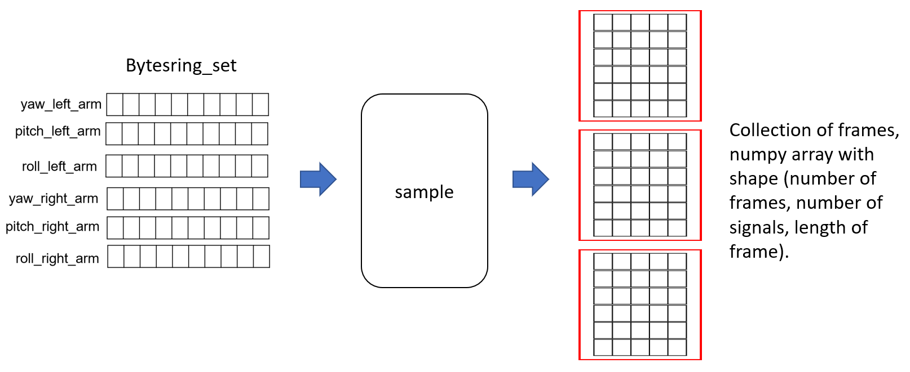
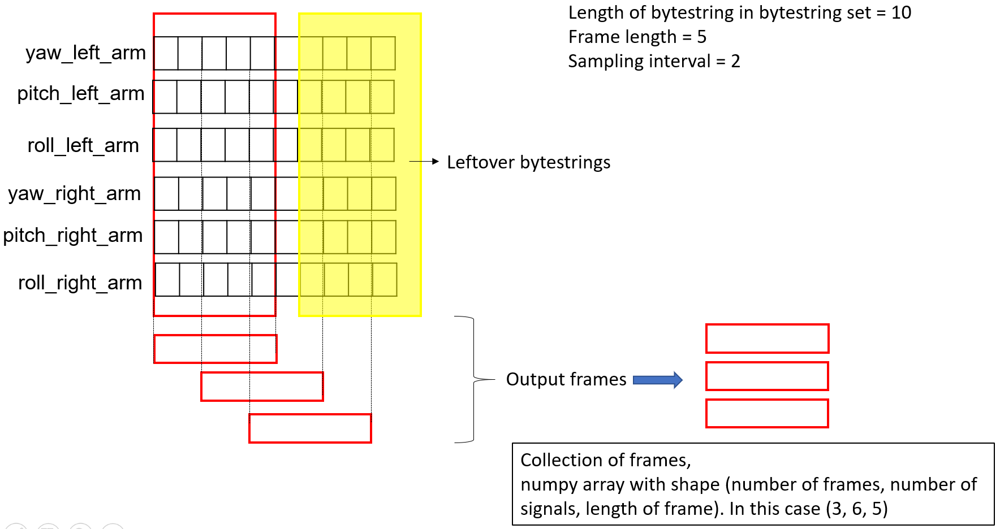
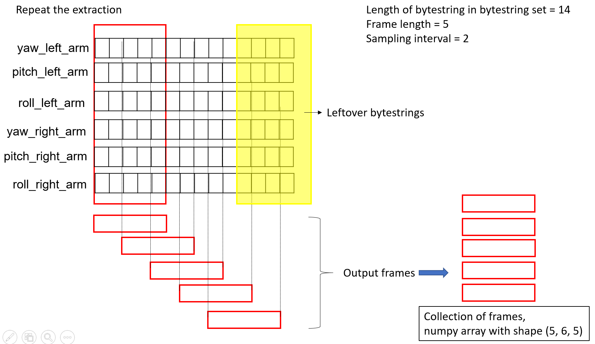
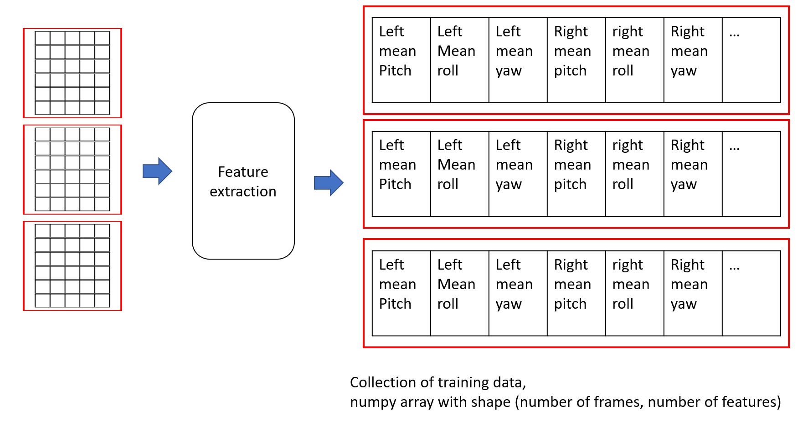

# Drangler
Dance Data Wrangler

## Setup python enviroment
If your havn't already, download <a href="https://conda.io/en/latest/miniconda.html">conda</a>.

cd to root of this folder, and 
```
conda env create -f environment.yml
conda activate cg3002
```

## Install drangler
cd to root of this folder, and 
```
python setup.py install
```
You may now import drangler globally.

## Using drangler

```
from drangler import Sampler

num_of_signals = 6
frame_length = 5
sampling_interval = 2

# Extract frames
sampler = Sampler.Sampler(num_of_signals, frame_length, sampling_interval)
frame_collection = sampler.sample(bytestring_set) # bytestring_set is a 2D numpy array of bytestrings 
```
See pytest.py for more sample scripts

### Sampler.sample()


First Incoming bytestring set


Subsequent bytestring set



### Feature extraction 

