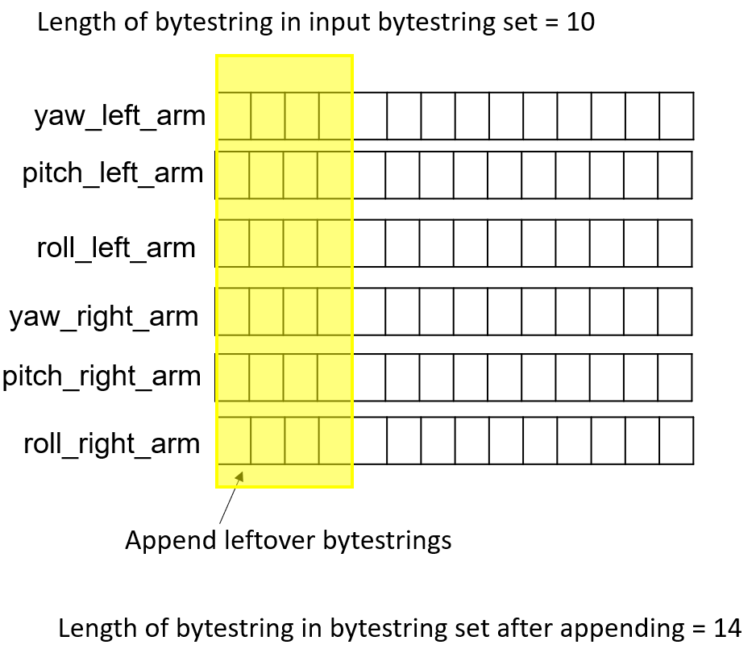

# Drangler
Dance Data Wrangler

## Setup python enviroment
If your havn't already, download conda.

cd to root of this folder, and 
```
conda env create -f environment.yml
conda activate cg3002
```

## Install drangler
cd to root of this folder, and 
```
python setup.py install
```
You may now import drangler globally.

## Using drangler
See pytest.py for sample scripts

### Sampler.sample()



